# nowcasting_benchmark
This repository is an accompaniment to a forthcoming article (preprint available [here](https://www.researchgate.net/publication/360360121_Benchmarking_Econometric_and_Machine_Learning_Methodologies_in_Nowcasting) or [here](https://unctad.org/webflyer/benchmarking-econometric-and-machine-learning-methodologies-nowcasting)) benchmarking common nowcasting and machine learning methodologies. It illustrates how to estimate each of the methods examined in the analysis in either R or Python. 17 methodologies were tested in nowcasting quarterly US GDP using data from the Federal Reserve of Economic Data (FRED). The variables chosen were those specified in [Bok, et al (2018)](https://www.newyorkfed.org/medialibrary/media/research/staff_reports/sr830.pdf). The methodologies were tested on a period dating from Q1 2002 to Q3 2022.

In applied nowcasting exercises, ideally, several methodologies should be employed and their results compared empirically for final model selection. In practice, this is difficult due to the fragmented landscape of different nowcasting methodology frameworks and implementations. This repository aims to make things significantly easier by giving fully runnable boilerplate code in R or Python for each methodology examined in this benchmarking analysis. The `methodologies/` directory contains self-contained Jupyter notebooks illustrating how each methodology can be run in the nowcasting context with an example using data from FRED and testing from 2005 to 2010. This was to reduce runtime for illustration, users can select their own testing periods if so desired.

All the notebooks assume initial input data is in the format of seasonally adjusted growth rates in the highest frequency of the data (monthly in this case), with a date colum in the beginning and a separate column for each variable. Lower frequency data should have their values listed in the final month of that period (e.g. December for yearly data, March, June, September, or December for quarterly data), with no data / NAs in the intervening periods or for missing data at the end of series. An example is below.

Also necessary is a metadata CSV listing the name of the series/column and its frequency. Once these two conditions are met, it should be possible to run any of the methodologies on your own dataset, with adjustments as needed using the Notebooks as a guide. Below is a short overview of each of the methodologies, followed by graphical results of the full benchmarking analysis showing predictions on different data vintages.

#### Recommendation for a single methodology
If you only have bandwidth or interest to try out one methodology, the LSTM is recommended. It is accessible, available in four different programming languages (both R and Python notebooks are included in the `methodologies/` directory), and straightforward to estimate and generate predictions given the data format stipulated above. It has shown strong predictive performance in relation to the other methodologies, including during shock conditions, and will not throw estimation errors on certain data. It does, however, have hyperparameters that may need to be tuned if initial performance is not good. This process can be done from within the _nowcast\_lstm_ library via the `hyperparameter_tuning` function. It is also the only implementation with built-in functionality for variable selection. In this analysis, input variables were taken as given, but often this is not the case. The `variable_selection` function will select best-performing variables from a pool of candidate variables. Both hyperparameter tuning and variable selection can also be performed together with the `select_model` function. See the documentation for the [nowcast_lstm](https://github.com/dhopp1/nowcast_lstm) library for more information.

## Methodologies
- **ARMA** (`model_arma.ipynb`): 
	- <ins>_background_</ins>: [Wikipedia](https://en.wikipedia.org/wiki/Autoregressive%E2%80%93moving-average_model)
	- <ins>_language, library, and function_</ins>: Python,[`ARIMA`](https://alkaline-ml.com/pmdarima/modules/generated/pmdarima.arima.ARIMA.html) function of [`pmdarima`](https://alkaline-ml.com/pmdarima/index.html) library
	- <ins>_commentary_</ins>: Univariate benchmark model. Acceptable performance in normal/non-volatile times, extremely limited use during any shock periods. Potential use as another way to fill ["ragged-edge"](https://halshs.archives-ouvertes.fr/halshs-00460461/document) missing data for component series in other methodologies, as opposed to mean-filling.
- **Bayesian mixed-frequency vector autoregression** (`model_bvar.ipynb`):
 	- <ins>_background_</ins>: [Wikipedia](https://en.wikipedia.org/wiki/Bayesian_vector_autoregression), [ECB working paper](https://www.ecb.europa.eu/pub/pdf/scpwps/ecb.wp2453~465cb8b18a.en.pdf)
	- <ins>_language, library, and function_</ins>: R, `estimate_mfbvar ` function of [`mfbvar`](https://cran.r-project.org/web/packages/mfbvar/mfbvar.pdf) library
	- <ins>_commentary_</ins>: Difficult to get data into proper format for the function to estimate properly, making dynamic/programmatic changing and selection of variables and overall usage hard, but doable.  Very performant methodology in this benchmarking analysis, ranking second-best in terms of RMSE and best in terms of MAE. However, predictions were very volatile, with highest month-to-month revisions in predictions on average. Also may produce occasional large outlier predictions or fail to estimate on a dataset due to convergence, etc., issues. This library/implementation cannot handle yearly variables.
- **Decision tree** (`model_dt.ipynb`):
 	- <ins>_background_</ins>: [Wikipedia](https://en.wikipedia.org/wiki/Decision_tree_learning)
	- <ins>_language, library, and function_</ins>: Python,[`DecisionTreeRegressor`](https://scikit-learn.org/stable/modules/generated/sklearn.tree.DecisionTreeRegressor.html) function of [`sklearn`](https://scikit-learn.org/stable/index.html) library
	- <ins>_commentary_</ins>: Simple methodology, not traditionally used in nowcasting. Doesn't handle time series, handled via including additional variables for lags. Poor performance in this benchmarking analysis. The four tree-based methodologies in this analysis, decision trees, random forest, and gradient boost, learn most of their information from the latest available data, so have difficulties predicting things other than the mean in early data vintages. See `model_gb.ipynb` for a means of addressing this. All three also have difficulties predicting values more extreme than any they have seen before, limiting their use in shock periods, e.g. during the COVID crisis. Has hyperparameters which may need to be tuned.
- **DeepVAR** (`model_deepvar.ipynb`):
 	- <ins>_background_</ins>: [Working paper](https://arxiv.org/abs/1704.04110)
	- <ins>_language, library, and function_</ins>: Python, [`DeepVAREstimator`](https://ts.gluon.ai/stable/api/gluonts/gluonts.model.deepvar.html) function of [`GluonTS`](https://ts.gluon.ai/stable/) library
	- <ins>_commentary_</ins>: Originally developed as a forecasting tool with the business context in mind. Generates probabilistic forecasts via an autoregressive recurrent neural network (RNN). Its performance in this analysis was poor, akin to that of an improved ARMA model. Depending on hyperparameters, it is slow to estimate compared with the other methodologies in this analysis. Its syntax is also complicated to get working for the nowcasting context.
- **Dynamic factor model (DFM)** (`model_dfm.ipynb`):
 	- <ins>_background_</ins>: [Wikipedia](https://en.wikipedia.org/wiki/Dynamic_factor), [FRB NY paper](https://papers.ssrn.com/sol3/papers.cfm?abstract_id=3075844), [UNCTAD research paper](https://unctad.org/webflyer/estimation-coincident-indicator-international-trade-and-global-economic-activity)
	- <ins>_language, library, and function_</ins>: R, `dfm` function of [`nowcastDFM`](https://cran.r-project.org/web/packages/nowcastDFM/nowcastDFM.pdf) library
	- <ins>_commentary_</ins>: De facto standard in nowcasting, very commonly used. Middling performance in this analysis. May require assigning variables to different ["blocks"](https://www.sciencedirect.com/science/article/abs/pii/S0304407610002083) or groups, which can be an added complication. In this benchmarking analysis, the DFM without blocks (equivalent to one "global" blocks/factor) performed worse than the model with the blocks specified by the FED. The model also fails to estimate on many datasets due to uninvertibility of matrices. Estimation may also take a long time depending on convergence of the expectation-maximization algorithm. Estimating models with more than 20 variables can be very slow. This library/implementation cannot handle yearly variables.
- **Elastic net** (`model_elasticnet.ipynb`):
	- <ins>_background_</ins>: [Wikipedia](https://en.wikipedia.org/wiki/Elastic_net_regularization)
	- <ins>_language, library, and function_</ins>: Python, [`ElasticNet `](https://scikit-learn.org/stable/modules/generated/sklearn.linear_model.ElasticNet.html) function of [`sklearn`](https://scikit-learn.org/stable/index.html) library
	- <ins>_commentary_</ins>: OLS with introduction of L1 and L2 regularization penalty terms. Can potentially help with multicollinearity issues of OLS in the nowcasting context. Performance is expectedly better than that of OLS in this benchmarking analysis, with less volatile predictions. Overall it was the best performer amongst methodologies that do not natively handle time series. Introduces the Lasso alpha hyperparameter and L1 ratio, which need to be tuned.
- **Gradient boosted trees** (`model_gb.ipynb`):
	- <ins>_background_</ins>: [Wikipedia](https://en.wikipedia.org/wiki/Long_short-term_memory)
	- <ins>_language, library, and function_</ins>: Python,[`GradientBoostingRegressor`](https://scikit-learn.org/stable/modules/generated/sklearn.ensemble.GradientBoostingRegressor.html) function of [`sklearn`](https://scikit-learn.org/stable/index.html) library
	- <ins>_commentary_</ins>: Very performant model in traditional machine learning applications. Doesn't handle time series, handled via including additional variables for lags. Poor performance in this benchmarking analysis. However, performance can be substantially improved by training separate models for different data vintages, details in `model_gb.ipynb` example file. This method can be applied to any of the methodologies that don't handle time series (OLS, random forest, etc.), but it had the biggest positive impact in this benchmarking analysis for gradient boosted trees. Has hyperparameters which may need to be tuned.
- **Lasso** (`model_lasso.ipynb`):
	- <ins>_background_</ins>: [Wikipedia](https://en.wikipedia.org/wiki/Lasso_(statistics))
	- <ins>_language, library, and function_</ins>: Python, [`Lasso `](https://scikit-learn.org/stable/modules/generated/sklearn.linear_model.Lasso.html) function of [`sklearn`](https://scikit-learn.org/stable/index.html) library
	- <ins>_commentary_</ins>: OLS with introduction of L1 regularization penalty term. Can potentially help with multicollinearity issues of OLS in the nowcasting context. Performance is expectedly better than that of OLS in this benchmarking analysis, with less volatile predictions. Overall it was better than ridge regression, but worse than elastic net. Introduces the Lasso alpha hyperparameter which needs to be tuned.
- **Long short-term memory neural network (LSTM)** (`model_lstm.ipynb`):
	- <ins>_background_</ins>: [Wikipedia](https://en.wikipedia.org/wiki/Long_short-term_memory), [first article](https://www.researchgate.net/publication/363509881_Economic_Nowcasting_with_Long_Short-Term_Memory_Artificial_Neural_Networks_LSTM), [second article](https://www.researchgate.net/publication/360990457_Performance_of_LSTM_neural_networks_in_nowcasting_global_trade_during_the_COVID-19_crisis)
	- <ins>_language, library, and function_</ins>: Python or R, `LSTM` function of [`nowcast_lstm`](https://github.com/dhopp1/nowcast_lstm) library. Also available in [Python](https://pypi.org/project/nowcast-lstm/), [R](https://github.com/dhopp1/nowcastLSTM), [MATLAB](https://github.com/dhopp1/nowcast_lstm_matlab), and [Julia](https://github.com/dhopp1/NowcastLSTM.jl).
	- <ins>_commentary_</ins>: Very performant model, best performer in terms of RMSE, second-best in terms of MAE. Able to handle any frequency of data in either target or explanatory variables, easiest data setup process of any implementation in this benchmarking analysis. Couples high predictive performance with relatively low volatility, e.g. in contrast with Bayesian VAR, which also has good predictive performance, but is quite volatile. Can handle an arbitrarily large number of input variables without affecting estimation time and can be estimated on any dataset without error. Has hyperparameters which may need to be tuned.
- **Mixed-frequency vector autoregression (MF-VAR)** (`model_var.ipynb`):
	- <ins>_background_</ins>: [Wikipedia](https://en.wikipedia.org/wiki/Vector_autoregression), [Minneapolis Fed paper](https://www.minneapolisfed.org/research/wp/wp701.pdf)
	- <ins>_language, library, and function_</ins>: Python,[`VAR`](https://pyflux.readthedocs.io/en/latest/var.html) function of [`PyFlux`](https://pyflux.readthedocs.io/en/latest/index.html) library
	- <ins>_commentary_</ins>: Has been used in nowcasting. Middling performance in this benchmarking analysis. The PyFlux implementation can be difficult to get working and may not run on versions of Python > 3.5.
- **Mixed data sampling regression (MIDAS)** (`model_midas.ipynb`):
	- <ins>_background_</ins>: [Wikipedia](https://en.wikipedia.org/wiki/Mixed-data_sampling), [paper](https://www.sciencedirect.com/science/article/abs/pii/S0169207010000427)
	- <ins>_language, library, and function_</ins>: R, `midas_r` function of [`midasr`](https://cran.r-project.org/web/packages/midasr/midasr.pdf) library
	- <ins>_commentary_</ins>: Has been used in nowcasting, solid performance in this benchmarking analysis. Difficult data set up process to estimate and get predictions. 
- **Midasml** (`model_midasml.ipynb`):
	- <ins>_background_</ins>: [Working paper](https://arxiv.org/pdf/2005.14057.pdf)
	- <ins>_language, library, and function_</ins>: R, `cv.sglfit` function of [`midasml`](https://cran.r-project.org/web/packages/midasml/midasml.pdf) library
	- <ins>_commentary_</ins>: Relatively new methodology that builds on MIDAS models by introducing LASSO regularization. Solid performance (third-best) in this analysis. Relatively difficult syntax to get working in the nowcasting context. 
- **Multilayer perceptron (feedforward) artificial neural network** (`model_mlp.ipynb`):
	- <ins>_background_</ins>: [Wikipedia](https://en.wikipedia.org/wiki/Multilayer_perceptron), [paper](https://mpra.ub.uni-muenchen.de/95459/1/MPRA_paper_95459.pdf)
	- <ins>_language, library, and function_</ins>: Python, [`MLPRegressor `](https://scikit-learn.org/stable/modules/generated/sklearn.neural_network.MLPRegressor.html) function of [`sklearn`](https://scikit-learn.org/stable/index.html) library
	- <ins>_commentary_</ins>: Has been used in nowcasting, decent performance in this benchmarking analysis. Doesn't handle time series, handled via including additional variables for lags. Has hyperparameteres which may need to be tuned.
- **Ordinary least squares regression (OLS)** (`model_ols_ridge.ipynb`):
	- <ins>_background_</ins>: [Wikipedia](https://en.wikipedia.org/wiki/Ordinary_least_squares)
	- <ins>_language, library, and function_</ins>: Python, [`LinearRegression `](https://scikit-learn.org/stable/modules/generated/sklearn.linear_model.LinearRegression.html) function of [`sklearn`](https://scikit-learn.org/stable/index.html) library
	- <ins>_commentary_</ins>: Extremely popular approach to regression problems. Doesn't handle time series, handled via including additional variables for lags. Middling performance in this benchmarking analysis and very volatile, will also probably suffer from multicollinearity if many variables are included.
- **Random forest** (`model_rf.ipynb`):
	- <ins>_background_</ins>: [Wikipedia](https://en.wikipedia.org/wiki/Random_forest)
	- <ins>_language, library, and function_</ins>: Python,[`RandomForestRegressor`](https://scikit-learn.org/stable/modules/generated/sklearn.ensemble.RandomForestRegressor.html) function of [`sklearn`](https://scikit-learn.org/stable/index.html) library
	- <ins>_commentary_</ins>: Popular methodology in classical machine learning, combining the predictions of many random decision trees. Doesn't handle time series, handled via including additional variables for lags. Poor performance in this benchmarking analysis. Has hyperparameters which may need to be tuned.
- **Ridge regression** (`model_ridge.ipynb`):
	- <ins>_background_</ins>: [Wikipedia](https://en.wikipedia.org/wiki/Ridge_regression#:~:text=Ridge%20regression%20is%20a%20method,econometrics%2C%20chemistry%2C%20and%20engineering.)
	- <ins>_language, library, and function_</ins>: Python, [`RidgeRegression `](https://scikit-learn.org/stable/modules/generated/sklearn.linear_model.Ridge.html) function of [`sklearn`](https://scikit-learn.org/stable/index.html) library
	- <ins>_commentary_</ins>: OLS with introduction of L2 regularization penalty term. Can potentially help with multicollinearity issues of OLS in the nowcasting context. Performance is expectedly slightly better than that of OLS in this benchmarking analysis, with less volatile predictions. Introduces the ridge alpha hyperparameter which needs to be tuned.
- **XGBoost** (`model_xgboost.ipynb`):
	- <ins>_background_</ins>: [Wikipedia](https://en.wikipedia.org/wiki/XGBoost)
	- <ins>_language, library, and function_</ins>: Python,[`XGBRegressor`](https://xgboost.readthedocs.io/en/stable/python/python_api.html) function of [`sklearn`](https://xgboost.readthedocs.io/en/stable/index.html) library
	- <ins>_commentary_</ins>: Similar methodolgy to gradient boost with added regularization and implementation tweaks. Performance is very similar to that of gradient boost.

## Scatter plots
These plots show MAE and RMSE plotted against average revision (i.e., volatility). The ideal model would be in the lower left corner (low error and low volatility).
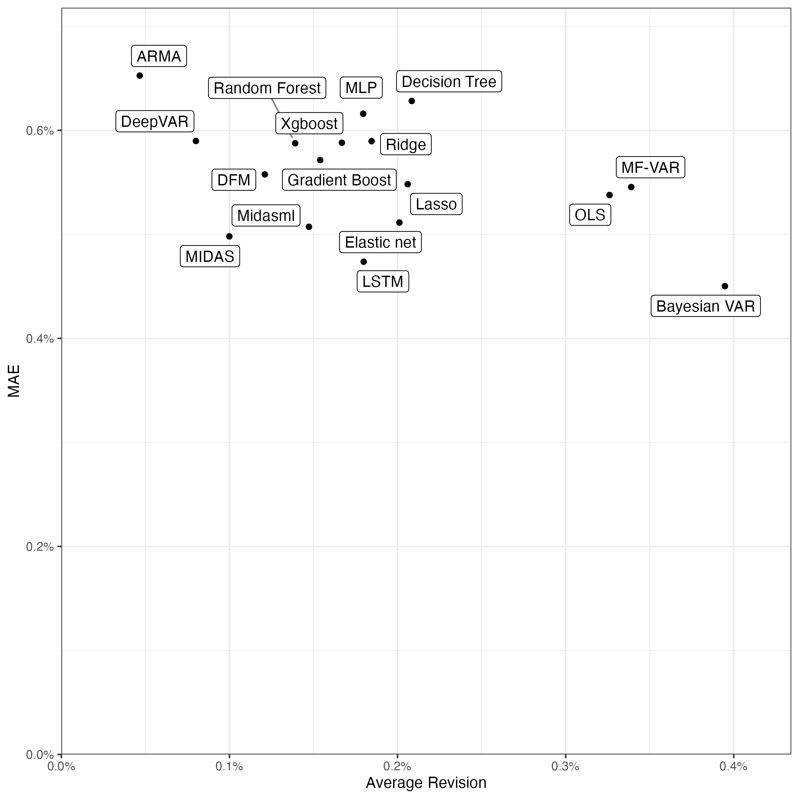
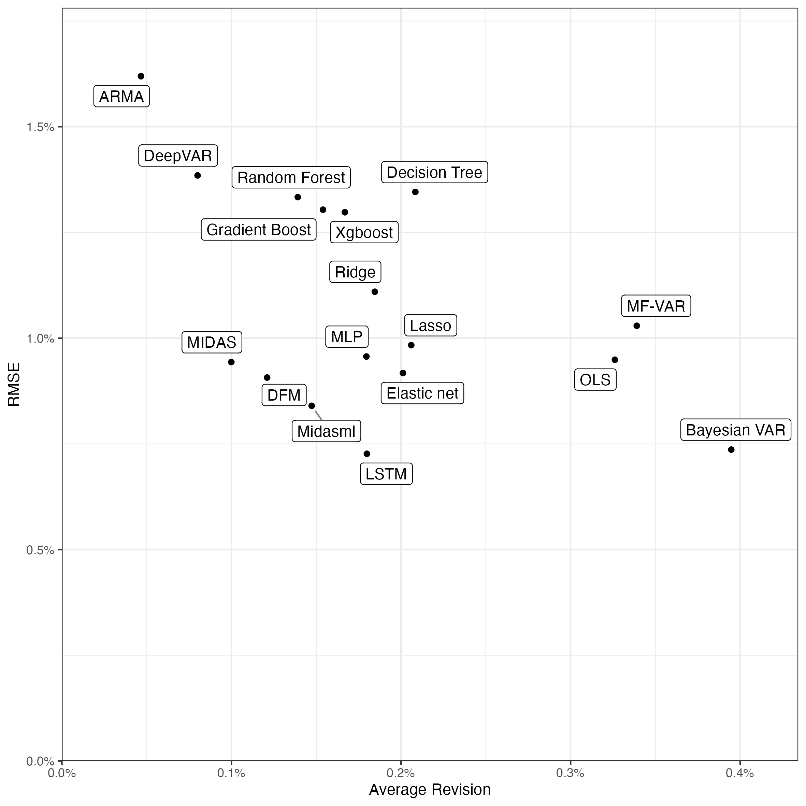

## Graphical results
Thee plots show actuals and nowcasts at different time vintages for each methodology. Ordered alphabetically.

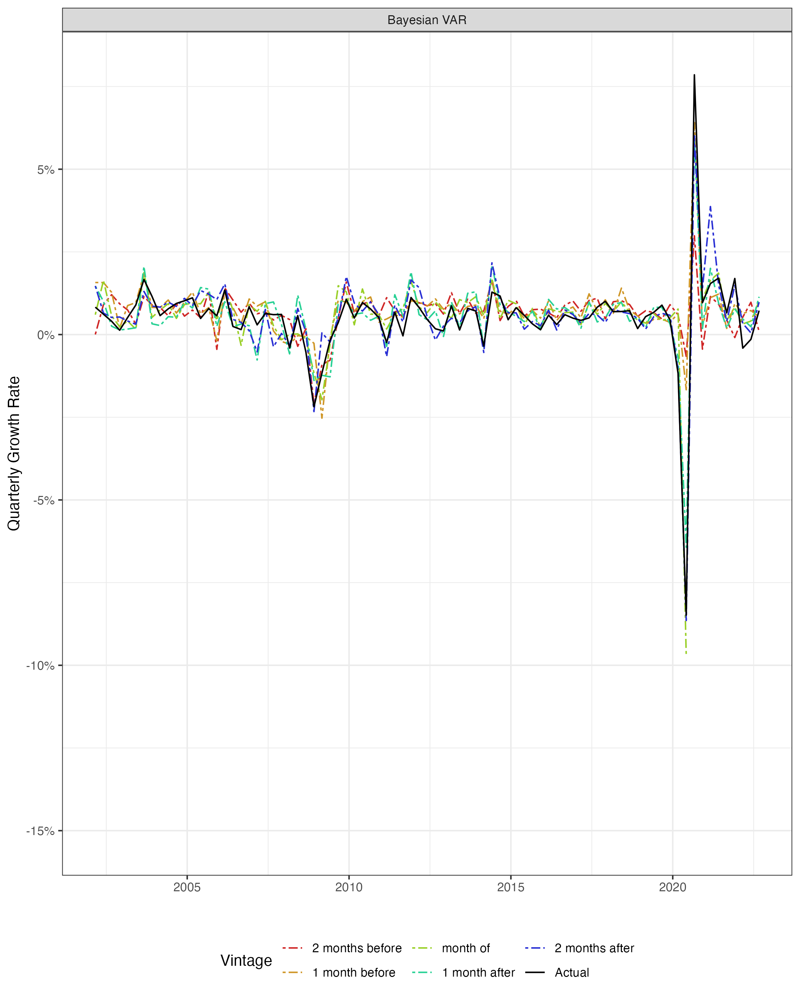

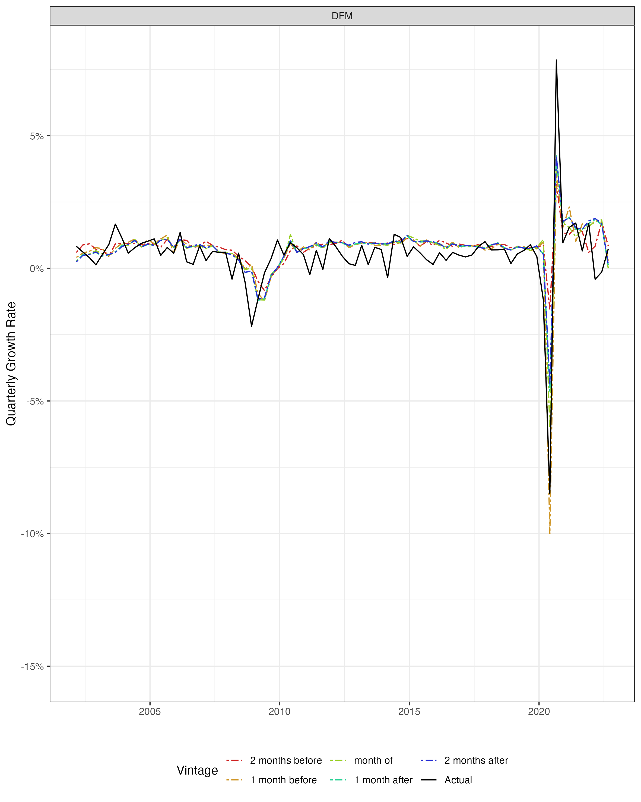
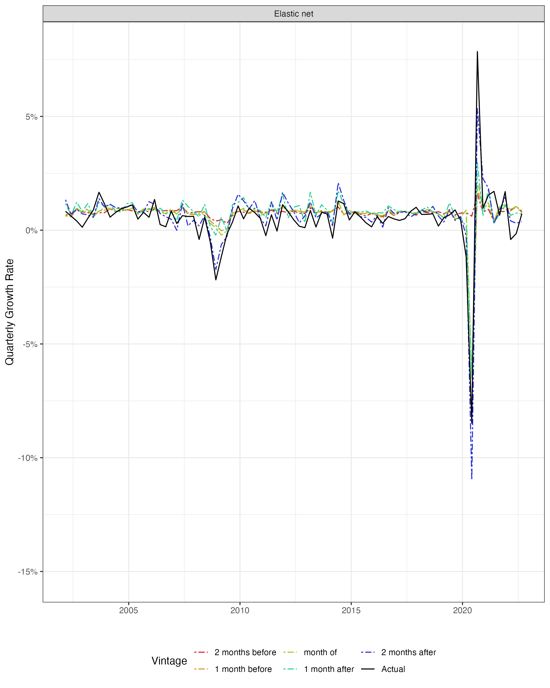
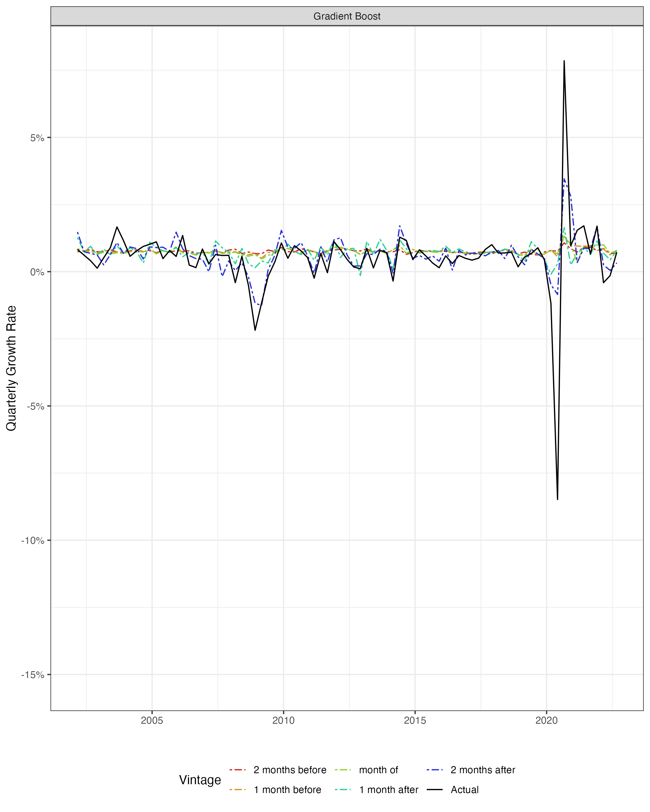

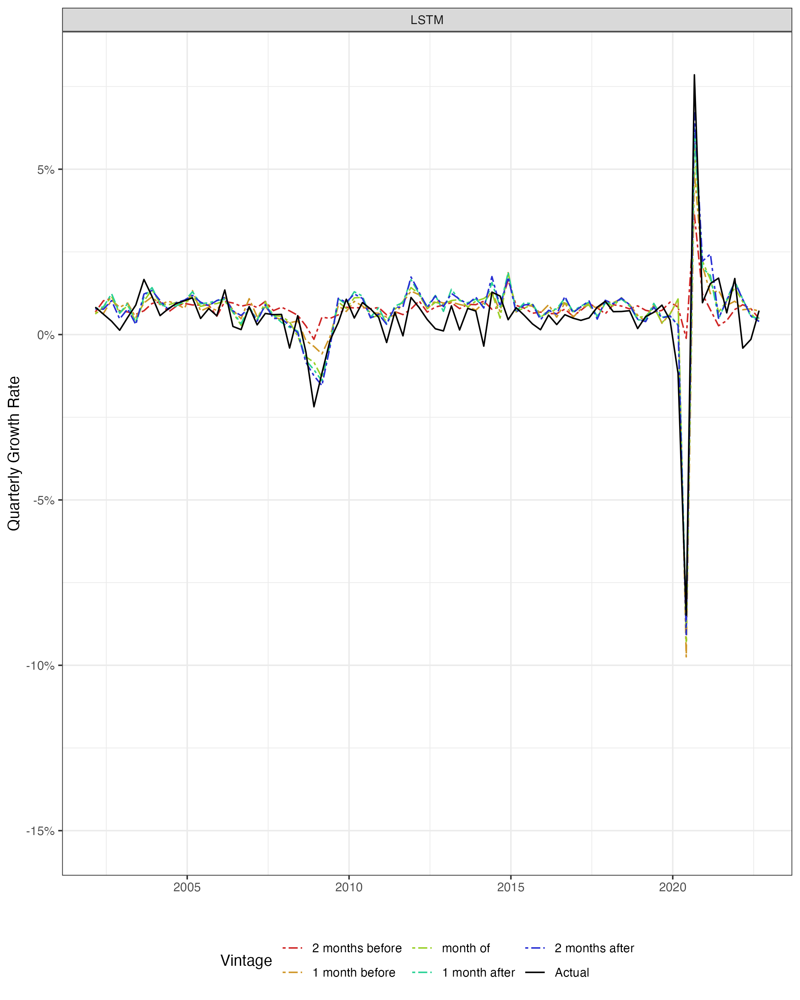

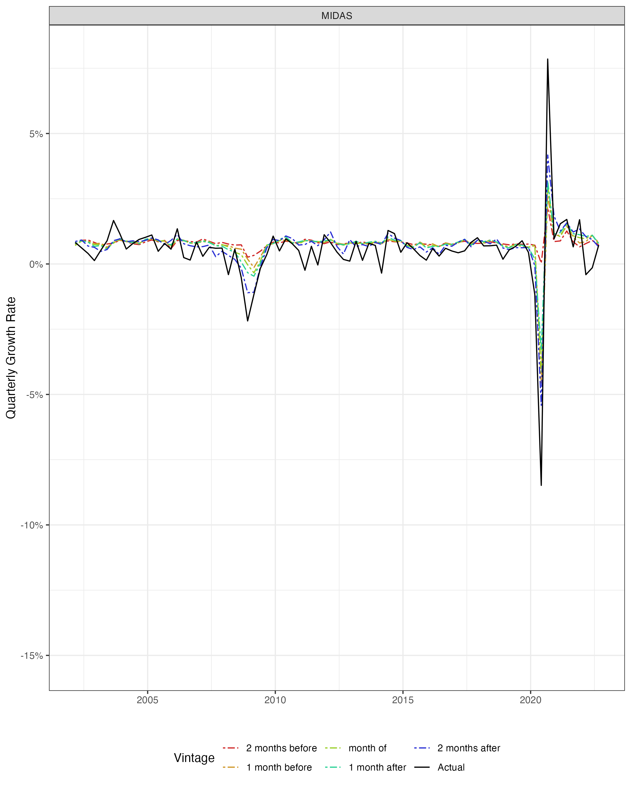

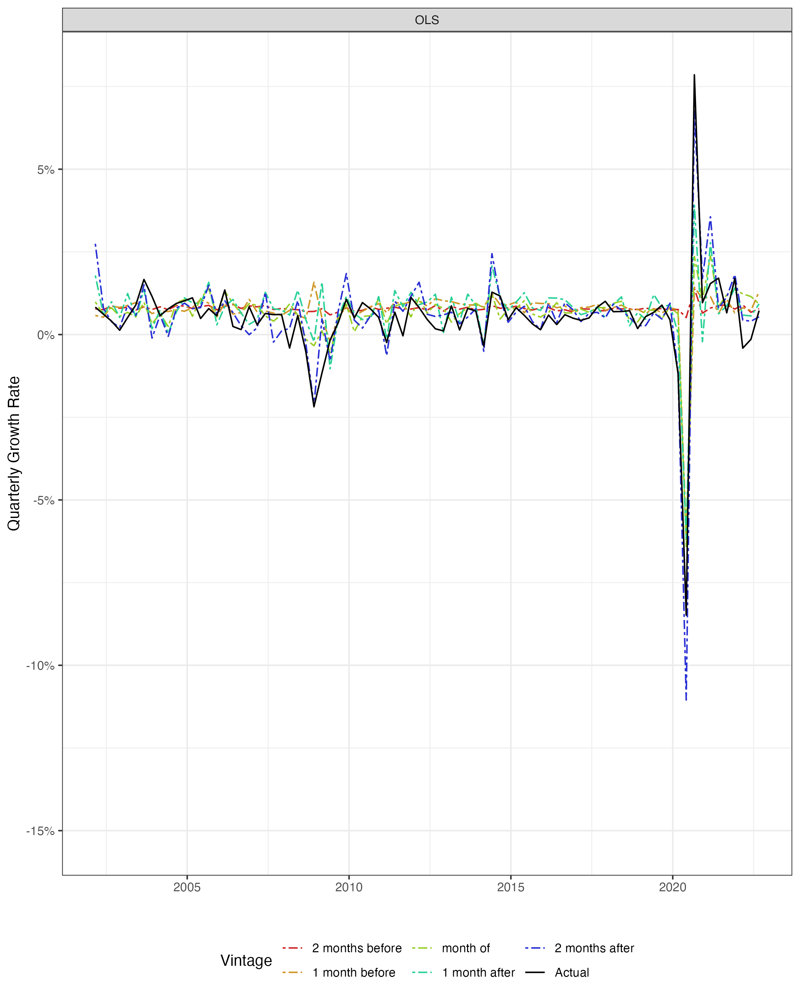

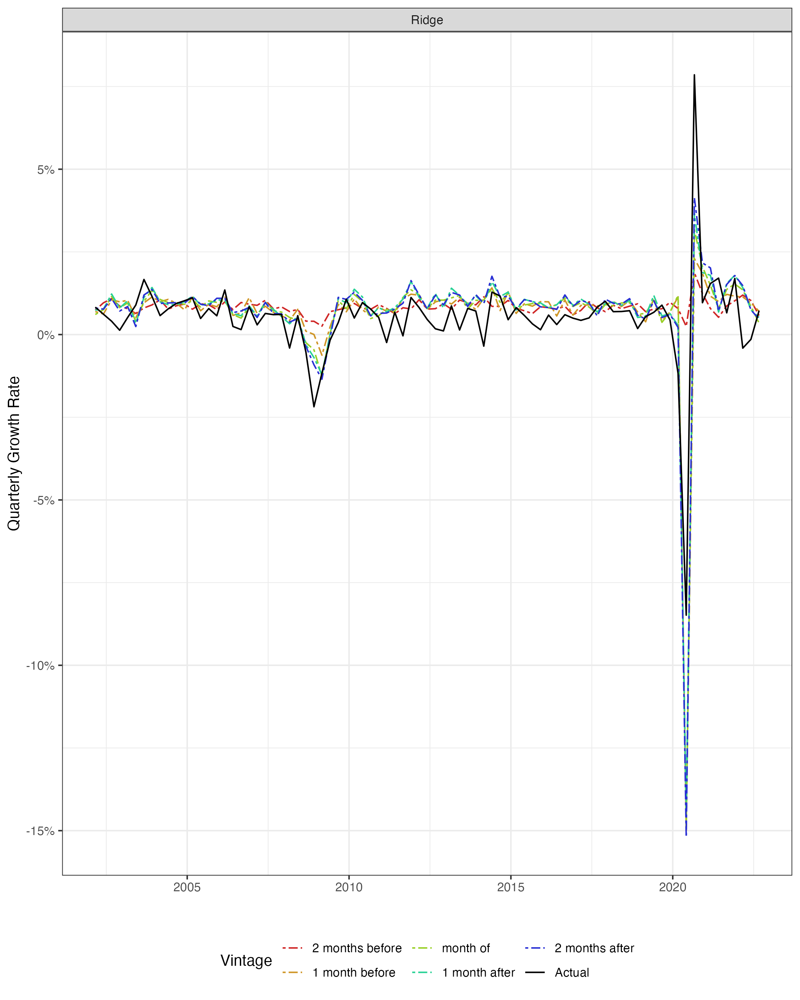
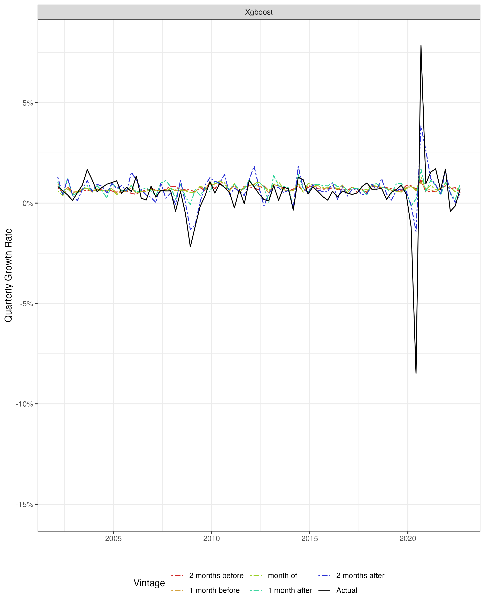